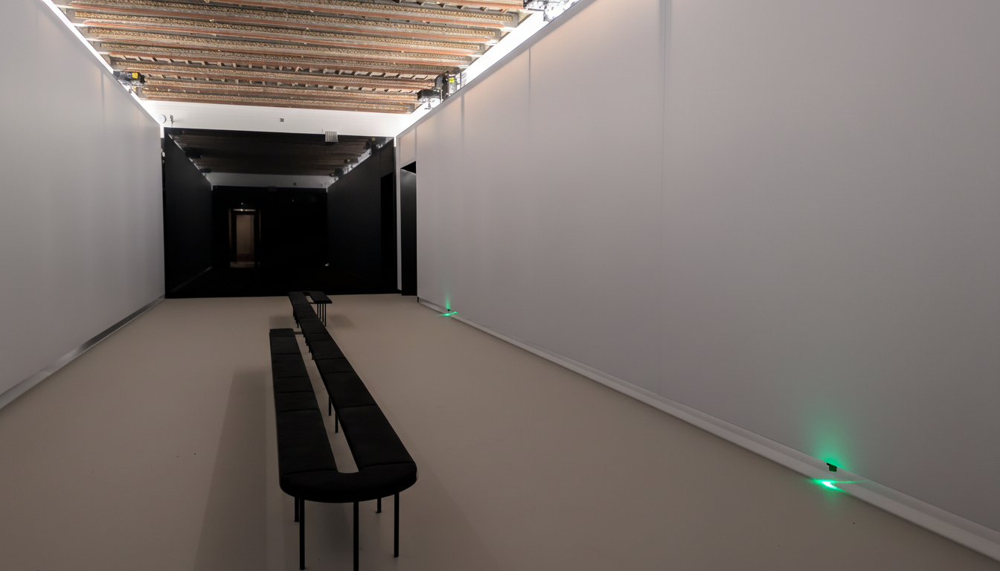
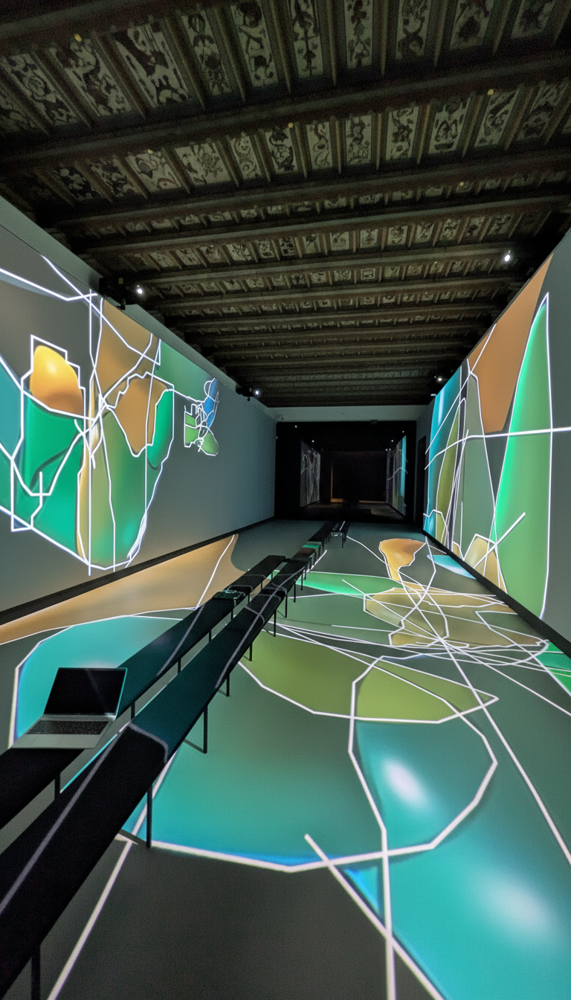
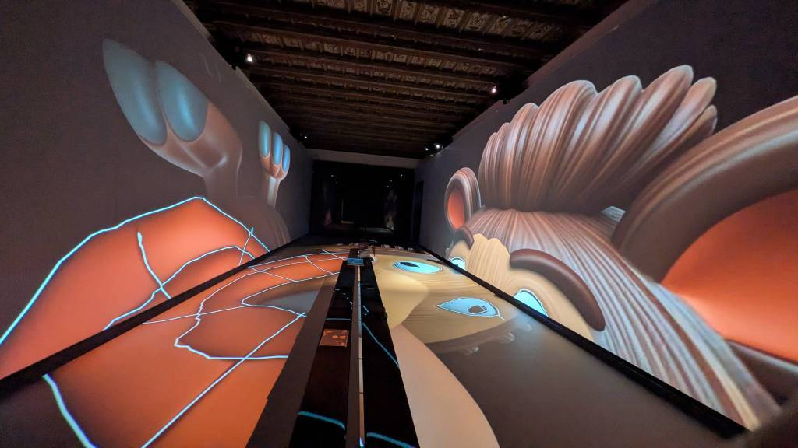

# Imerssive room Museum of Prague
We are providing technical details on how to prepare audio visual content for the immersive room at Museum of Prague main building at Florenc, Prague, Czech Republic. 

<table>
  <tr>
    <td>
      
    </td>
    <td rowspan="2">
      
    </td>
  </tr>
  <tr>
    <td>
      
    </td>
  </tr>
</table>

## Photo
Convert to equirectangular format first, then you can convert to cubemap [online](https://jaxry.github.io/panorama-to-cubemap/). [Source code](https://github.com/jaxry/panorama-to-cubemap). 
## Video
We are using [Pixera media server](https://pixera.one/en/) for projector blending and synchronization. No need to create videomapping, just pass your clean video to Pixera server.

* one wall: 9974x1929px
* floor: 6830 x 2160px
* 10bit 4:2:2 YcBcR
* video codec (HAP) / NotchLC (preffered)
* accepts NDI streams if you need real-time video

Output three NDI streams from your app - one for each wall, one for floor or you can send one large video that we can split between the walls and floor. We can also mirror the content to other walls / floor (for example you can output just single stream for walls and one for floor if you don't mind same video on both walls). 

In case you can't output NDI, you can use Spout:
* https://spout.zeal.co/
We provide Spout to NDI proxy to send the Spout texture to Media server. 

### Pre-render video

#### Capture NDI / Spout stream

##### NDI Tools
You can download [NDI Tools](https://ndi.video/tools/). NDI Tools should already include the [NewTek SHQ7 codec]([https://pixera.one/en/](https://www.vizrt.com/support/product-updates/codecs-utilities/newtek-codec-for-windows/)). Output NDI stream from your application, use NDI Tools Studio Monitor to save the stream to disk (it will save it in .mov SHQ7 codec).

Unfortunetly, FFmpeg’s built-in SpeedHQ decoder does NOT support SHQ7 (YUVA422P with alpha, 10-bit-ish NewTek variant). So altought you can encode to HAP with ffmpeg, you can't decode .mov SHQ7 saved from NDI Tools Studio Monitor. For that you will need 3rd party paid plugin such as AfterCodecs for AE. 

##### OBS
You can use free [OBS software](https://obsproject.com/) along with [NDI plugin for OBS](https://github.com/DistroAV/DistroAV/releases) to record NDI streams. Better yet, OBS also supports the direct Spout capture. Unfortunetly, you might be limited by avaliable max resolution inside OBS based on current diplay setting and GPU.

##### Spout Recording only
* Another option is to use [LightJams Spout recorder](https://www.lightjams.com/spout-recorder.html) for capturing Spout stream. 
* One more worth looking into is open source [SpoutRecorder](https://github.com/leadedge/SpoutRecorder/). 

#### Preffered video CODEC
The best quality is achieved using NotchLC codec. The second, slightly worse option is HAP. If you can render to NotchLC. Info about HAP is below. Pixera server that is installed on the main server PC have built-in capability to [encode to NotchLC](https://help.pixera.one/pixera-251/notch-lc-encoding), NotchLC also provides [plugins](https://www.notch.one/downloads) for Adobe Premiere / After effects / Encoder that can be used. 

#### Convert Video to HAP codec

##### Ffmpeg
HAP codec can be included in ffmpeg build or using 3rd party paid plugins such as AfterCodecs for Adobe After Effects. See more [here](https://hap.video/using-hap.html).

On Windows you can check if your current ffmpeg build support HAP codec with  `ffmpeg -encoders | findstr /i hap`. Example terminal output on Windows: `V.S..D hap  Vidvox Hap`. Or on Linux / MacOS you can check with `ffmpeg -encoders | grep hap`. To converrt the video to HAP use command `ffmpeg -i input.mov -c:v hap output.mov` or `ffmpeg -i yourSourceFile.mov -c:v hap -format hap_q outputName.mov`.

To solve uneven resolution:  `ffmpeg -i test.mp4 -vf "scale=6828:2160" -c:v hap -format hap_q -c:a aac testhap.mov` You need to target resolution divisible by 4 (ie 28 or 32). 

## Audio
We have 12.4 2D speaker layout but we are effectively using 12.1 (all 4 subwoofers are fed from single audio source). 
Speaker positions are provided in normalized coordinates from -1 to +1 with a centroid at (0,0). 
* [speaker_layout](https://github.com/museumofprague/immersive_room_rider/blob/main/speaker_preset/muzeum_prahy.json) 

We can provide you with spatial audio realtime engine. The system expects OSC messages with virtual audio sources positions and it will calculate needed volumes for all speakers to create an illusion of the sound coming from given direction. 

## Dimensions
6.998 * 18 meters

## Interactivity
* READY We have about 50 ipads 11 tablets at our disposal for interactive input from users (surveys, drawing, games). We can run websocket and https server at the control PC that can be reached from iPads using local WiFi. This way we can have multiplayer, real-time input and show output on large scale video projection. 
* IN PROGRESS We are also currently working on implementing Lidar sensors that will track the users movement in the immersive room (2D, feet positions).
* IN PROGRESS We are working on implementing realtime spatial audio engine.  

## Lidar - Pharus system
We have 4 2D 360 lidars [PicoScan150](https://www.sick.com/se/en/catalog/products/lidar-and-radar-sensors/lidar-sensors/picoscan100/pics150-01000-core-2-6-io/p/p682000?tab=detail) from Sick installed in the room. We are using [Pharus](https://ars.electronica.art/futurelab/en/pharus/) tracking system from Ars Electronica center. 

Lidar IP addresses (for maintanance only - do not interface directly!): 
* 192.168.0.67 - right back (closest to Langweil model of Prague room)
* 192.168.0.66 - right front
* 192.168.0.65 - left wall back
* 192.168.0.64 - left wall front (closest to the entrance from foyer)
  * port 7503
  * 255.255.255
  * adressing mode: static

picoScan 150 Specs:
* 25m range
* 276 Degree Angle
* 1 Degree Res

## Templates
WIP

* Touchdesigner
* Processing

#### Notes
* [Java Wrapper for NDI](https://github.com/WalkerKnapp/devolay)
